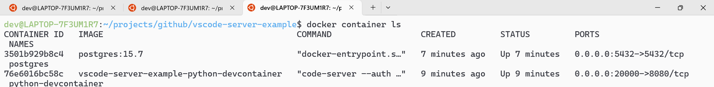
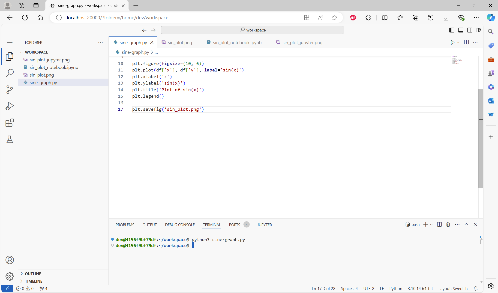
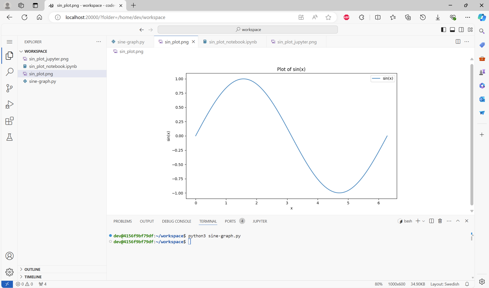
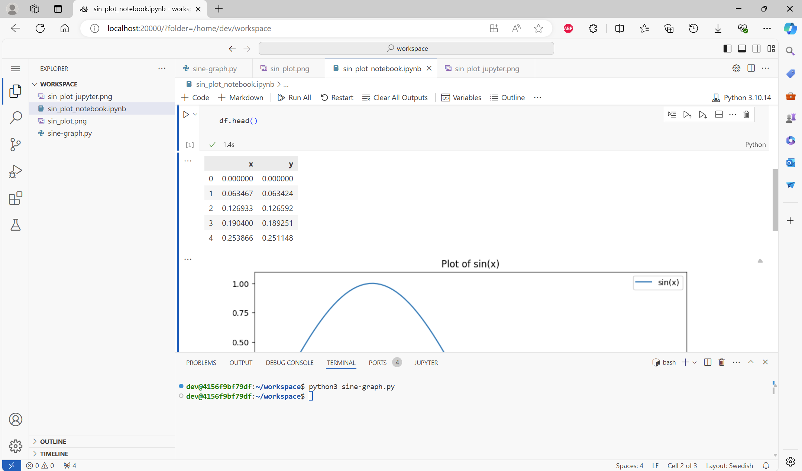
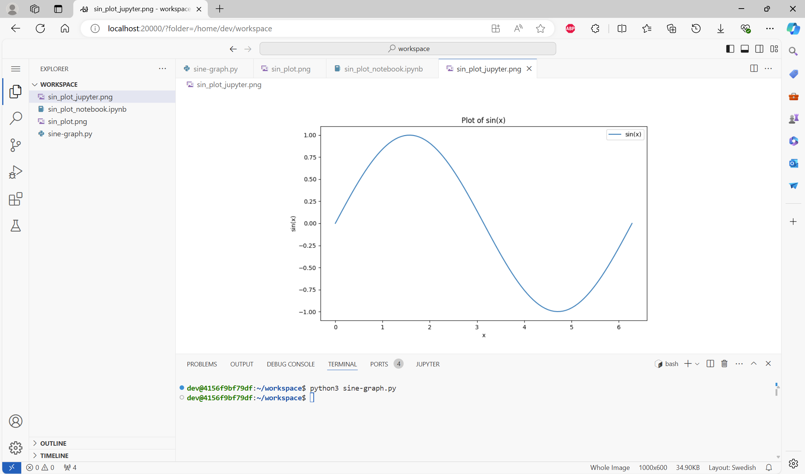
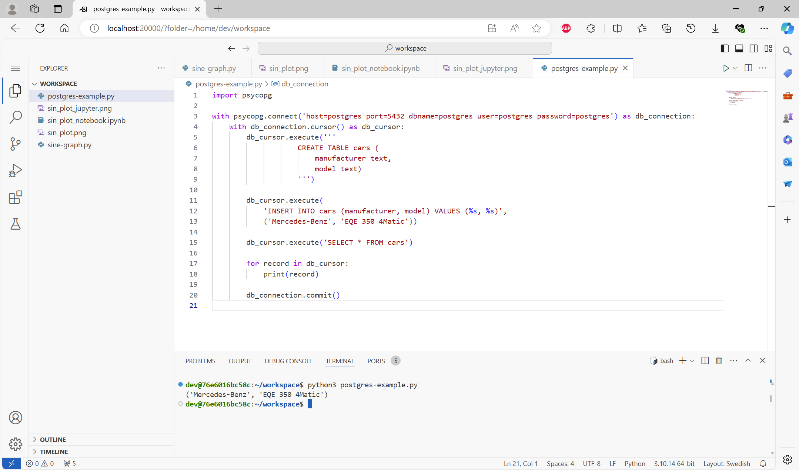

# vscode-server-example

In this example I demonstrate how to use Docker containers and VSCode server for setting up a development environment. There isn't actually any VSCode devcontainers used, but instead Docker compose. The Docker compose includes a `python-devcontainer` and a `postgres` container. The development is done via web browser.

WSL2 Ubuntu 2x.xx, Docker and Make are required in this demo.

## Setup

Clone the repository from the GitHub. Then create a Docker network with `make docker/network/create`. Then build the python-devcontainer with `make docker/build/python-devcontainer` which will take some time as there are tons of libraries included in the Docker image. Then start the python-devcontainer with `make docker/run/python-devcontainer` and the Postgres with `make docker/run/postgres`.

Check with `docker container ls` that everything is in order.

## Usage

Go to `http://localhost:20000/?folder=/home/dev/workspace` with your web browser (I tested only with Edge). You can run the examples with `python3 sine-graph.py` and from the Jupyter notebook clicking `Run All`.

Then you can run the Postgres example with `python3 postgres-example.py`.

